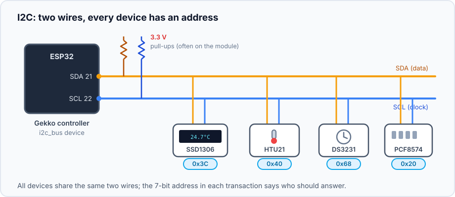
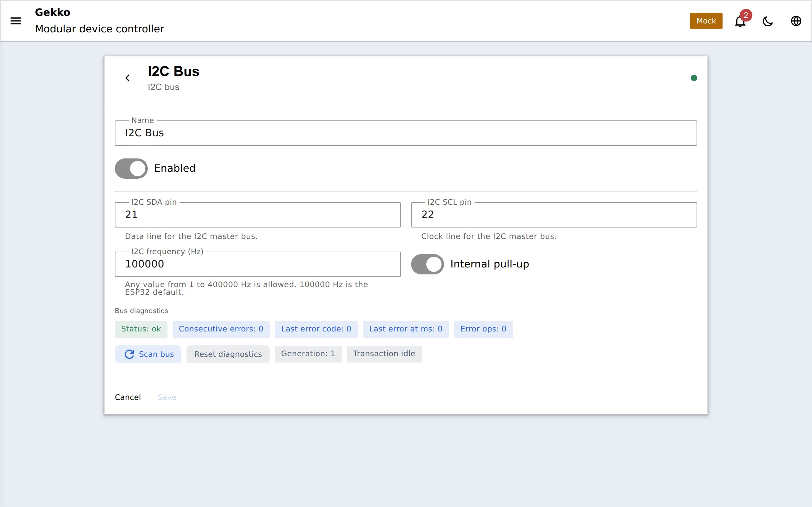

## Что такое I2C?

I2C (Inter-Integrated Circuit, «ай-сквер-C») — рабочая лошадка двухпроводной
шины в любительской электронике: одна линия **data** (SDA) и одна линия
**clock** (SCL), общие для всех устройств. Как и в [1-Wire](/gekko/ru/reference/devices/onewire-bus/),
на одних и тех же проводах может жить много устройств — но здесь у каждого
чипа короткий **7-битный адрес**, обычно указанный в даташите (и часто
переключаемый solder jumper'ами).

В Gekko шина — это отдельное устройство, `i2c_bus`: оно владеет двумя пинами,
запускает скан адресов, а каждое добавленное I2C-устройство объявляет от него
зависимость.

## Проводка

Обе линии имеют open-drain и требуют подтягивающих резисторов к 3.3 V. На
практике их редко ставят вручную: **почти каждый breakout-модуль (OLED, RTC,
HTU21, expander) уже имеет подтяжки на плате**, а устройство `i2c_bus` по
умолчанию включает внутренние подтяжки ESP32. Только голый чип на длинном
кабеле требует явных резисторов (2.2–10 кΩ).

Устройства подключаются параллельно: SDA к SDA, SCL к SCL, плюс 3.3 V и GND.
Держите провода достаточно короткими (десятки сантиметров на стандартной
скорости) — I2C это шина уровня платы, а не кабельная шина вроде 1-Wire.

## Кто живёт на I2C-шине в Gekko

| Устройство | Типичный адрес |
| --- | --- |
| SSD1306 OLED display | `0x3C` (иногда `0x3D`) |
| HTU21 temperature + humidity | `0x40` |
| DS3231 real-time clock | `0x68` |
| PCF8574 / PCF8575 port expanders | `0x20`–`0x27` (задаётся jumper'ами) |

Каждое из них создаётся как отдельное устройство, зависящее от шины, со своим
адресом в собственной конфигурации. Два одинаковых чипа (например, два
PCF8574 на разных адресах) — это просто два устройства на одной шине; Gekko
не позволит создать два устройства с одним адресом на одной шине.

## Сканирование и диагностика

На странице устройства есть кнопка **Scan bus** — она проверяет все
допустимые адреса и показывает всё, что отвечает, что является самым быстрым
способом подтвердить проводку и узнать реальный адрес модуля. Ниже находятся
**bus diagnostics**: счётчики последовательных ошибок, последний код ошибки и
состояние транзакций, плюс кнопка сброса. Проблема с проводкой проявляется
здесь первой — датчики на больной шине показывают `dependency_blocked`, а не
ложные значения.

## Конфигурация

| Поле | По умолчанию | Значение |
| --- | --- | --- |
| `sdaPin` | `21` | Линия data (традиционные I2C-пины ESP32 — 21/22) |
| `sclPin` | `22` | Линия clock |
| `frequencyHz` | `100000` | Скорость шины, 1–400 000 Hz; 100 kHz — безопасный default, 400 kHz работает на короткой проводке |
| `internalPullup` | on | Использовать внутренние подтяжки ESP32 (нормально вместе с подтяжками на модулях) |
| `enabled` | on | Отключение шины блокирует все устройства на ней |

## Диагностика проблем

- **Scan ничего не находит** — классическая ошибка это перепутанные SDA/SCL;
  проверьте также 3.3 V и GND на модуле.
- **Устройство найдено по другому адресу** — jumper'ы (для expander'ов) или
  вариант OLED `0x3D`; используйте адрес, который показал скан.
- **Ошибки под нагрузкой / на длинных проводах** — уменьшите `frequencyHz` до
  100 kHz, укоротите проводку и держите кабели дисплея подальше от реле и
  сетевых проводов.
