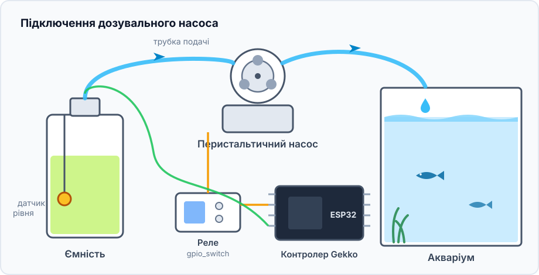
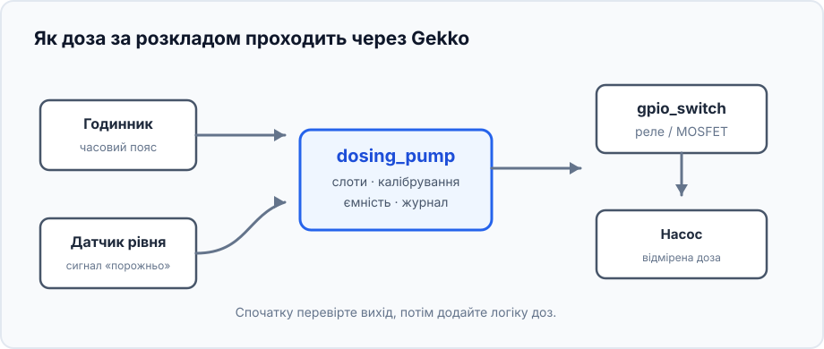
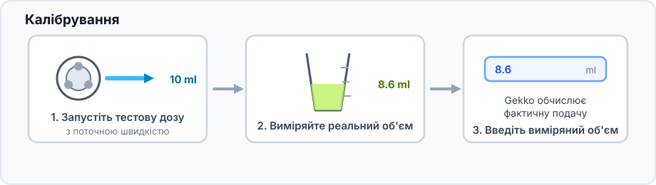
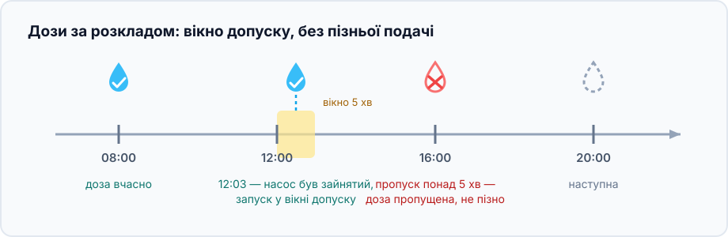
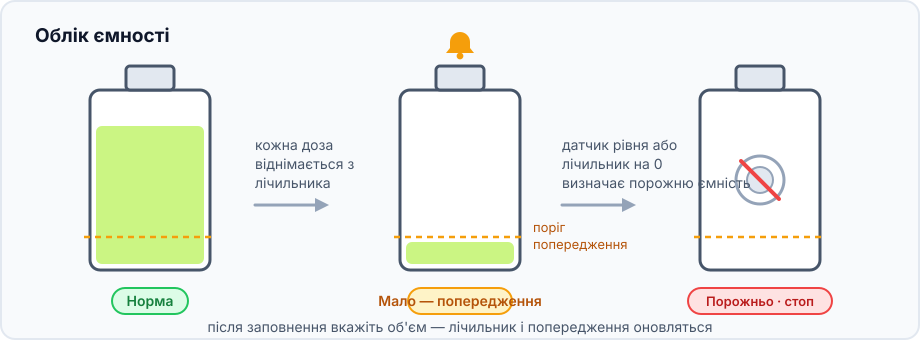

Цей проєкт додає невелику відмірену кількість рідини у заданий час: для
акваріумних добавок, добрив або іншого розчину, якому корисні кілька малих
повторюваних доз замість однієї великої.

## Що вийде

```text
Годинник → слоти доз → dosing_pump
                       ├→ GPIO-вимикач → насос
                       └→ лічильник ємності та журнал
```

## Обладнання та безпека



- ESP32, низьковольтний перистальтичний насос і реле або MOSFET, розрахований
  на насос.
- Трубка, ємність і мірний циліндр або ваги для калібрування.
- Необов'язковий поплавковий датчик рівня в ємності.

> Перші тести робіть чистою водою в мірний циліндр, а не невідомим об'ємом
> добавки в акваріум. Не підключайте мотор насоса безпосередньо до GPIO ESP32.

## Граф пристроїв і порядок створення



1. Вкажіть часовий пояс і дочекайтеся коректного часу NTP або додайте RTC
   DS3231.
2. Створіть [`gpio_switch`](/gekko/uk/reference/devices/gpio-switch/) для реле
   чи MOSFET; його безпечний стан має вимикати мотор.
3. З водою та мірним циліндром ненадовго увімкніть GPIO-вимикач вручну та
   переконайтеся, що мотор зупиняється.
4. За потреби створіть датчик рівня і перевірте стани «норма» та «порожньо».
5. Створіть `dosing_pump`: виберіть вимикач насоса, датчик, ємність і поріг
   попередження.

## Відкалібруйте фактичну подачу



Довжина й висота трубки, а також зношення змінюють подачу. Калібруйте з
остаточно прокладеною трубкою; рідина під час калібрування справді виходить із
ємності.

## Додайте перший розклад



Спочатку додайте одну малу дозу на кілька хвилин уперед і перевірте, що насос
вмикається один раз, а потім зупиняється. Давня пропущена доза не надолужується:
це запобігає небезпечній подачі накопиченого об'єму після перезапуску.

## Приклад збереженого розкладу


У прикладі чотири слоти по 12,5 мл: 08:00, 12:00, 16:00 та 20:00 — разом
50 мл на день. Це лише приклад структури: об'єм визначають тести води й
інструкція до конкретної добавки. Натисніть слот, щоб пропустити лише його
наступне спрацьовування, наприклад у день підміни води.

## Стежте за ємністю



Поповнюйте ємність до порогу попередження та вказуйте новий об'єм командою
**Set volume**. Датчик рівня додатково захистить від сухого ходу, якщо
лічильник неточний. Перші дні звіряйте тести й журнал доз.

## Типові проблеми

- **Доза не запускається:** перевірте годинник, часовий пояс, автоматичний
  режим і чи не позначена ємність як порожня.
- **Об'єм неправильний:** повторіть калібрування зі встановленою трасою трубки.
- **Мотор працює, рідина не рухається:** заповніть трубку водою та перевірте
  вхід, перегини й напрямок трубки.
- **Мотор не зупиняється:** негайно вимкніть GPIO-вихід і перевірте реле та
  його безпечний стан до ввімкнення автоматики.

Докладно про всі налаштування — у [довідці дозувального насоса](/gekko/uk/reference/devices/dosing-pump/).
