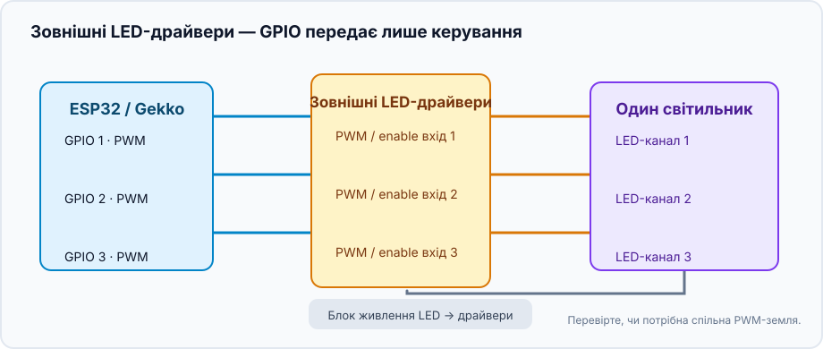
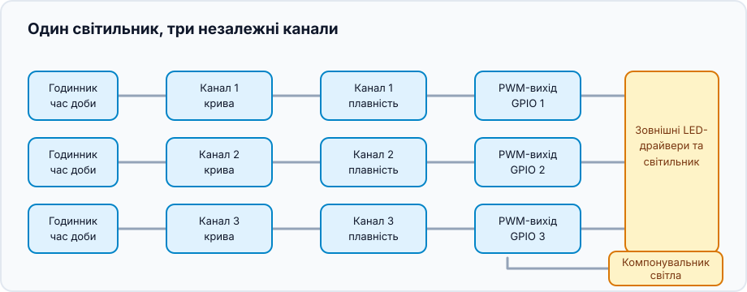
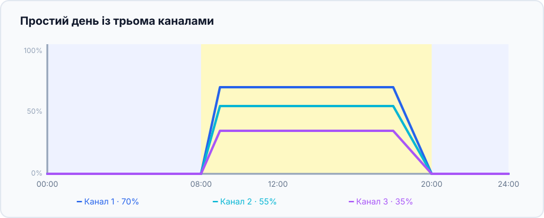

Цей проєкт об'єднує незалежні димовані LED-канали в один світильник. Канали
можуть бути будь-якими LED-лініями або іншими навантаженнями з PWM-керуванням:
назви та рівні задаєте ви. Gekko керує ритмом дня, а LED-драйвер або
MOSFET-каскад подає електричну потужність.

## Що вийде

```text
Годинник → криві каналів → плавні переходи → PWM-виходи → LED-драйвери → світильник
                                        └──────── компонувальник ────────┘
```

Кожен канал має власну криву, а один компонувальник дає всьому світильнику
спільний режим **Off**, **Manual** або **Scheduled**.

## Обладнання й безпека



- Контролер ESP32 та один відповідний PWM GPIO на канал.
- LED-драйвер із документованим PWM/enable-входом димування або MOSFET-каскад,
  розрахований на LED-навантаження й блок живлення.
- Окремий блок живлення належної потужності для LED. **Не** підключайте
  LED-лінію безпосередньо до GPIO ESP32.
- Спільна земля потрібна лише тоді, коли документація драйвера вимагає
  спільного низьковольтного PWM-опорного проводу. Перевірте напругу,
  полярність і розв'язку входу драйвера.

Спершу підключіть один канал і встановіть низький ручний рівень. Переконайтеся,
що яскравість змінюється очікувано, і тільки потім підключайте інші канали.

## Зберіть граф пристроїв



Для кожного фізичного каналу створіть ланцюжок:

1. Створіть [`analog_output`](/gekko/uk/reference/devices/analog-outputs/) для
   його GPIO, наприклад «PWM каналу 1».
2. Додайте `fade_analog_output`, спрямований на цей PWM-вихід: він робить
   плавними ручні зміни й переходи за розкладом.
3. Додайте `scheduled_analog_output`, спрямований на fade, наприклад «Крива
   каналу 1».
4. Повторіть для інших каналів, створіть один `analog_output_composer` —
   наприклад «Основне світло» — та додайте до нього всі scheduled outputs.

Компонувальник — звичайна точка керування. На щоденну панель додайте його, а
не окремі PWM-виходи.

## Намалюйте перший простий день

Почніть із кількох точок:

| Час | Канал 1 | Канал 2 | Канал 3 | Значення |
| --- | ---: | ---: | ---: | --- |
| 00:00 | 0% | 0% | 0% | ніч / вимкнено |
| 08:00 | 0% | 0% | 0% | початок підйому |
| 09:00 | 35% | 20% | 10% | м'який ранок |
| 12:00 | 70% | 55% | 35% | денний рівень |
| 18:00 | 70% | 55% | 35% | утримання |
| 20:00 | 0% | 0% | 0% | кінець спаду |



Ці відсотки — лише приклад форми кривої, а не рекомендація яскравості.
Починайте нижче цільового рівня, спостерігайте за світильником і його
мешканцями, потім змінюйте по одному параметру.

## Перевірте світильник

1. У компонувальнику виберіть **Manual** і встановіть кожному каналу мале
   значення. Перевірте всі канали та відсутність перегріву драйверів.
2. Поверніть **Off**: усі канали мають перейти до нуля.
3. Виберіть **Scheduled** і тимчасово поставте перехід на кілька хвилин
   уперед. Перегляньте підйом, утримання й згасання кожного каналу.
4. Перезапустіть контролер або тимчасово приберіть коректний час. Scheduled
   outputs мають безпечно перейти до нуля, а не залишити стару яскравість.

Коли проста крива працює надійно, назвіть канали за реальним світильником і
уточнюйте їхні рівні. Збережуваний профіль світильника й керована
акліматизація з'являться пізніше; поки компонувальник утримує наявні криві
разом.

## Поширені проблеми

- **Один канал працює навпаки:** перевірте логіку входу димування драйвера.
- **Світло стрибає:** scheduled output має вказувати на `fade_analog_output`,
  а не на початковий PWM-вихід.
- **Світильник темний:** перевірте годинник, режим компонувальника, зовнішній
  блок живлення LED та enable-вхід драйвера.
- **Змінюється один канал:** усі scheduled outputs мають бути в
  компонувальнику й посилатися на власний ланцюжок fade/output.

Деталі налаштувань і редактора кривих — у
[Analog outputs & light composer](/gekko/uk/reference/devices/analog-outputs/).
