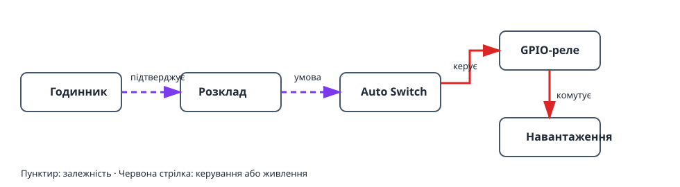

Цей проєкт вмикає та вимикає навантаження у заданий час. Фізичне реле
відокремлене від правила часу: **розклад** визначає, чи активне вікно, а
**Auto Switch** передає цю умову на GPIO-реле.

## Що вийде

```text
Годинник і часовий пояс → розклад → Auto Switch → GPIO-реле → навантаження
```

## Обладнання й безпека

- Плата ESP32 і релейний модуль, придатний для навантаження.
- Низьковольтне тестове навантаження, наприклад світлодіод.

> Не підключайте мережеву напругу безпосередньо до ESP32. Використовуйте
> закрите реле або контактор належної потужності та дотримуйтеся правил безпеки.

## Граф пристроїв і порядок створення



1. Укажіть часовий пояс контролера та дочекайтеся коректного годинника від NTP
   або додайте RTC DS3231. До цього розклад навмисно лишається невалідним.
2. Створіть [`gpio_switch`](/gekko/uk/reference/devices/gpio-switch/) для реле
   й задайте безпечний знеструмлений стан навантаження.
3. Вручну ввімкніть і вимкніть GPIO-пристрій із низьковольтним тестовим
   навантаженням.
4. Створіть [`schedule`](/gekko/uk/reference/devices/schedule/) із простим
   щоденним правилом, наприклад 09:00–09:10, **завжди увімкнено**.
5. Створіть `auto_switch`: виберіть GPIO-вимикач як ціль **switch**, розклад
   як **condition** і ввімкніть режим **Auto**.

Auto Switch об’єднує всі умови логічним І. За однієї умови реле ввімкнене лише
в активний час розкладу. Ручні режими ігнорують умови; після перевірки поверніть
Auto.

## Безпечна перевірка

1. Переконайтеся, що час і часовий пояс відповідають установці.
2. Створіть коротке вікно за кілька хвилин, збережіть його та спостерігайте
   стан розкладу і наступне перемикання.
3. Перевірте, що Auto Switch вмикає тестове навантаження на початку вікна та
   вимикає наприкінці.
4. У безпечній тестовій установці змініть час контролера або вимкніть
   синхронізацію. Розклад має стати невалідним чи неактивним, а реле — перейти
   до безпечного вимкненого стану.

## Типові проблеми

- **Реле не вмикається:** перевірте режим **Auto** і те, що розклад зараз
  активний.
- **Розклад невалідний:** налаштуйте часовий пояс і дочекайтеся NTP або
  підключіть DS3231.
- **Логіка реле зворотна:** спочатку перевірте GPIO-вимикач; інверсію вмикайте
  лише для реле, активного низьким рівнем.
- **Помилка на годину:** перевірте часовий пояс і літній час, а не окремі правила.

Докладніше — у розділі [«Розклади й автоматика»](/gekko/uk/guides/schedules-and-automation/).
