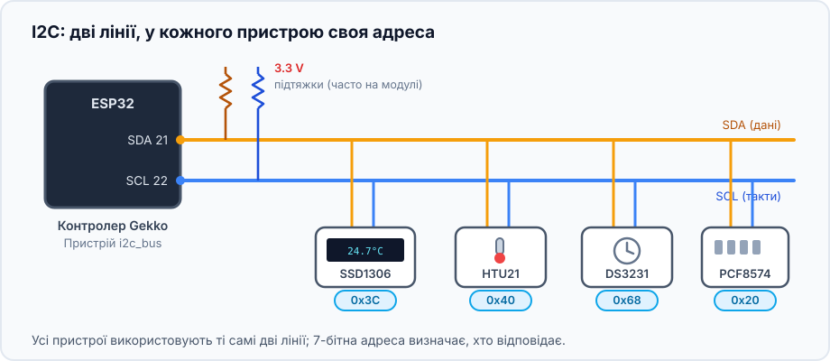
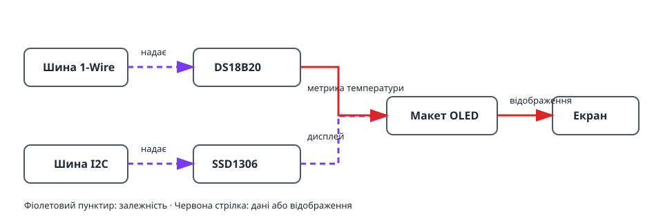
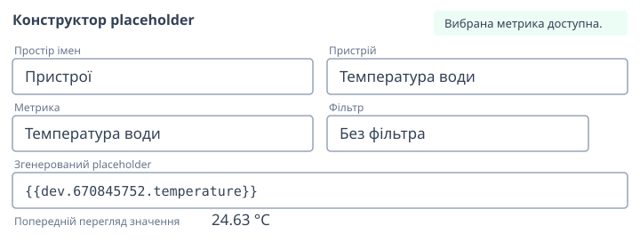
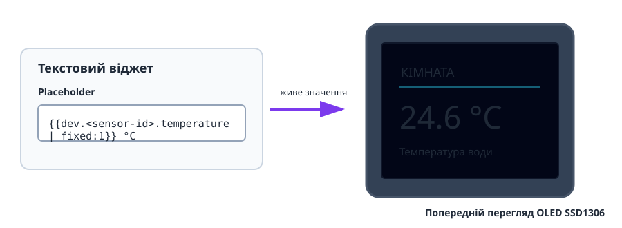

Цей проєкт перетворює датчик температури на невеликий екран статусу. DS18B20
працює на 1-Wire, а OLED SSD1306 — на I2C; макет дисплея використовує живу
метрику датчика.

## Що вийде

```text
DS18B20 → метрика температури → макет OLED → живий екран
                   ↑
        шина 1-Wire     шина I2C → дисплей SSD1306
```

## Обладнання

- ESP32 і DS18B20 з підтягувальним резистором 4,7 кОм між DATA та 3V3.
- I2C OLED SSD1306, зазвичай з адресою `0x3C`.
- Лінії SDA, SCL, 3V3 і GND між ESP32 та дисплеєм.



Не змішуйте підключення: DS18B20 використовує DATA 1-Wire, а OLED — SDA і SCL
I2C.

## Граф пристроїв і порядок створення



1. Створіть [`onewire_bus`](/gekko/uk/reference/devices/onewire-bus/),
   виконайте сканування та створіть
   [`ds18b20_temperature_sensor`](/gekko/uk/reference/devices/ds18b20/).
2. Створіть [`i2c_bus`](/gekko/uk/reference/devices/i2c-bus/) для SDA і SCL;
   якщо адреса OLED невідома, виконайте сканування.
3. Створіть `ssd1306` на цій шині з знайденою адресою та правильною панеллю.
4. Дочекайтеся `ready` датчика і дисплея, відкрийте **Design** та створіть
   текстовий віджет.
5. Вставте метрику температури через placeholder builder:

   ```text
   Кімната {{dev.<sensor-id>.temperature | fixed:1}} °C
   ```



Placeholder стає реальною залежністю дисплея, тому Gekko попередить про
видалення датчика, доки його метрика використовується в макеті.

## Перевірка екрана



1. Перевірте попередній перегляд перед збереженням на дисплей.
2. Переконайтеся, що OLED показує ту саму температуру, що й сторінка датчика.
3. Злегка нагрійте або охолодіть датчик і перевірте зміну значення.
4. У безпечній тестовій установці від’єднайте датчик. Його placeholder має
   стати порожнім або недоступним, не заважаючи решті макета.

## Типові проблеми

- **OLED порожній:** перевірте живлення, SDA/SCL, адресу I2C і панель екрана.
- **Немає значення датчика:** дочекайтеся `ready` та використовуйте placeholder
  builder, а не вводьте ID вручну.
- **Текст обрізано:** перевірте макет, зменште шрифт або додайте другу сторінку.
- **Датчик не видаляється:** спочатку приберіть або замініть його placeholder.

Докладніше — у [«Дисплеях і дизайнері макета»](/gekko/uk/guides/displays/).
