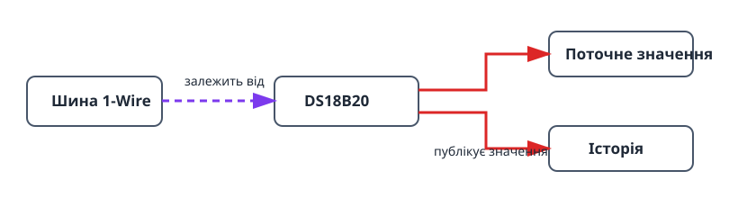

Цей проєкт збирає найменший корисний ланцюг датчика: DS18B20 на шині 1-Wire.
Він показує той самий порядок залежностей, що й більші системи, і дає поточну
температуру з графіком історії. Так можна перевірити підключення й розміщення
датчика до додавання термостата чи іншої автоматики.

## Що вийде

```text
Датчик DS18B20 → шина 1-Wire → поточне значення та історія температури
```

## Обладнання

- Плата ESP32.
- Датчик DS18B20.
- Підтягувальний резистор 4,7 кОм між лінією DATA датчика та 3V3.


Не залишайте лінію DATA без підтягування: без резистора шина може знаходити
датчик нестабільно або показувати недостовірні значення.

## Граф пристроїв і порядок створення



1. Створіть [`onewire_bus`](/gekko/uk/reference/devices/onewire-bus/) на GPIO,
   підключеному до лінії DATA датчика.
2. Відкрийте шину й виконайте **сканування**. Переконайтеся, що з’явився
   потрібний датчик.
3. Створіть [`ds18b20_temperature_sensor`](/gekko/uk/reference/devices/ds18b20/)
   за знайденою адресою.
4. Дочекайтеся статусу `ready`, відкрийте датчик і перевірте поточне значення
   та графік історії.

Сканування прив’язує датчик до унікальної 64-бітної ROM-адреси. На одній шині
можна використати кілька датчиків, але для кожної знайденої адреси потрібен
окремий екземпляр.

## Перевірка показань

1. Після стабілізації датчика в одному місці порівняйте значення з перевіреним
   термометром.
2. Ненадовго перенесіть датчик із теплішого середовища в холодніше й
   переконайтеся, що значення та історія змінюються в очікуваному напрямку.
3. У безпечній тестовій установці від’єднайте датчик. Він має стати
   недоступним або перейти в помилковий стан, а не показувати старе значення
   як поточне.

## Типові проблеми

- **Сканування не знаходить датчик:** перевірте DATA, 3V3, GND і
  підтягувальний резистор 4,7 кОм.
- **Температура стрибає:** перевірте кабель і розміщення датчика, перш ніж
  додавати згладжування або калібрування.
- **Вибрано не той датчик:** повторіть сканування та використайте показану
  ROM-адресу; не розрізняйте датчики лише за кольором кабелю чи місцем монтажу.

Коли показання стане надійним, використайте його як залежність температури в
[термостаті з реле](/gekko/uk/projects/thermostat-with-relay/).
