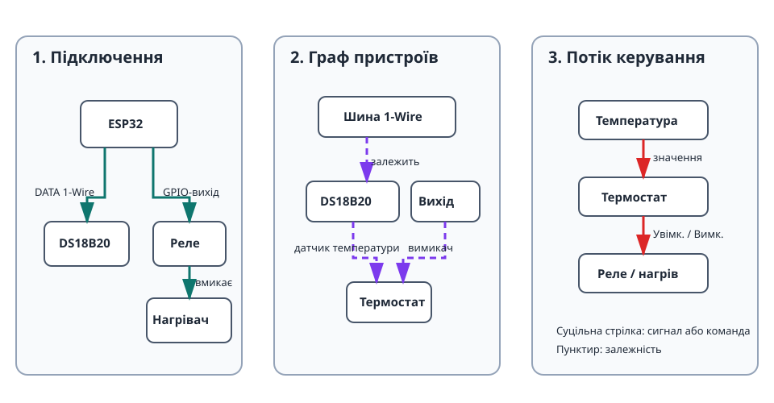

Цей проєкт керує нагрівачем або охолоджувачем за датчиком температури DS18B20.
Це перший повний багатопристроєвий сценарій: фізичне підключення, залежності,
автоматика, живий статус і безпечна поведінка.

## Що вийде

```text
Датчик DS18B20 → термостат → реле → нагрівач або охолоджувач
```

Термостат отримує поточну температуру, порівнює її з ціллю та гістерезисом, а
потім керує реле.

## Обладнання

- Плата ESP32.
- Датчик DS18B20 із підтягувальним резистором 4,7 кОм між DATA і 3V3.
- Релейний модуль, придатний для навантаження.
- Нагрівач або охолоджувач, підключений через реле за документацією модуля та
  правилами безпеки для мережевої напруги.

> Ніколи не підключайте мережеве навантаження безпосередньо до ESP32. Використовуйте
> реле або контактор належної потужності й дотримуйтеся місцевих правил електробезпеки.

## Граф пристроїв і порядок створення



1. Створіть [`onewire_bus`](/gekko/uk/reference/devices/onewire-bus/) на GPIO
   датчика.
2. Виконайте **сканування** та створіть знайдений
   [`ds18b20_temperature_sensor`](/gekko/uk/reference/devices/ds18b20/).
3. Створіть [`gpio_switch`](/gekko/uk/reference/devices/gpio-switch/) для реле
   й задайте безпечний знеструмлений стан навантаження.
4. Вручну перемкніть GPIO-вимикач і переконайтеся, що реле працює очікувано.
5. Створіть [`thermostat`](/gekko/uk/reference/devices/thermostat/) та виберіть
   DS18B20 як залежність температури, а GPIO-вимикач — як залежність вимикача.

Не створюйте термостат, доки датчик і вимикач не досягнуть `ready`.

## Мінімальні налаштування термостата

Для нагрівача задайте цільову температуру й невелику смугу гістерезису. Наприклад,
за цілі 25,0 °C і гістерезису 0,5 °C термостат вмикає нагрів нижче 24,5 °C і
вимикає за 25,0 °C. Переконайтеся, що режим відповідає навантаженню: для нагріву
та охолодження напрямок вмикання протилежний.

Вкажіть безпечні межі до початку експлуатації. Якщо датчик недоступний або
значення виходить за межі, термостат має припинити керування виходом; безпечний
стан GPIO-вимикача є останнім захистом.

## Перевірка роботи

1. Переконайтеся, що шина, датчик, вимикач і термостат мають `ready`.
2. Порівняйте температуру з перевіреним термометром.
3. Тимчасово змініть ціль, щоб термостат мав перемкнути реле.
4. Переконайтеся, що реле спрацьовує на межі гістерезису, а не при кожному
   малому коливанні.
5. У безпечній тестовій установці від’єднайте датчик або його шину й перевірте
   повернення виходу до безпечного стану.

## Типові проблеми

- **Сканування не знаходить датчик:** перевірте GPIO DATA, 3V3/GND і резистор 4,7 кОм.
- **Логіка реле зворотна:** вмикайте інверсію лише після перевірки активного низького рівня модуля.
- **Не вибирається залежність:** створіть і ввімкніть сумісний датчик або вимикач, дочекайтеся `ready`.
- **Вихід перемикається надто часто:** збільште гістерезис і перевірте місце датчика.
