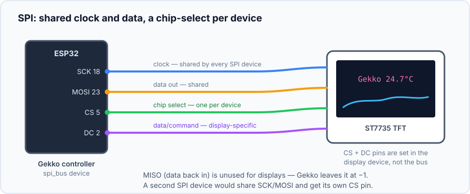
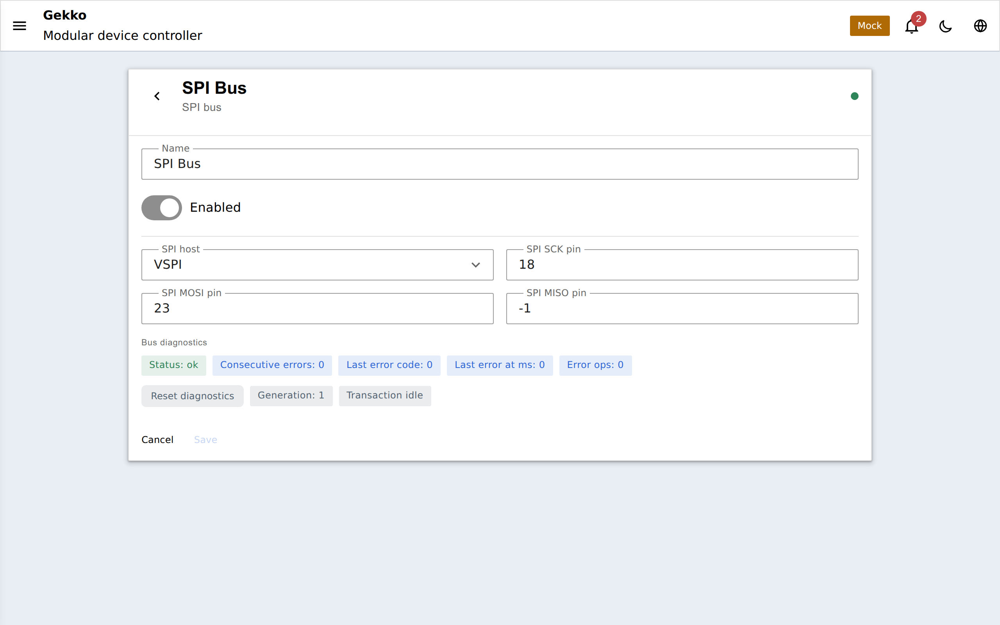

## Що таке SPI?

SPI (Serial Peripheral Interface) — це швидка послідовна шина: якщо
[I2C](/gekko/uk/reference/devices/i2c-bus/) зупиняється на 400 kHz, SPI охоче
розганяється до десятків MHz, саме тому кольорові дисплеї використовують її.
Компроміс — більше дротів: спільний **clock** (SCK) і **data** (MOSI,
опційно MISO для зворотних даних), плюс окрема лінія **chip-select** (CS)
для кожного пристрою — так вони розрізняються замість адрес.

У Gekko шина — це пристрій `spi_bus`: він володіє спільними пінами SCK/MOSI/
MISO та апаратним SPI-host ESP32. Сьогодні його єдиний споживач —
**ST7735 color TFT**; власні CS/DC/reset піни дисплея належать пристрою
дисплея, а не шині.

## Підключення

Типовий модуль ST7735 мапиться так (назви на шовкографії можуть відрізнятися):

| Пін модуля | Пін ESP32 (типово) | Належить |
| --- | --- | --- |
| SCK / CLK | GPIO 18 | `spi_bus` |
| SDA / MOSI / DIN | GPIO 23 | `spi_bus` |
| CS | GPIO 5 | пристрою `st7735` |
| DC / A0 | GPIO 2 | пристрою `st7735` |
| RES / RST | — (або будь-який вільний GPIO) | пристрою `st7735` |
| VCC, GND, LED/BLK | 3.3 V / GND | живлення |

Дисплеї ніколи не надсилають дані назад, тож **MISO лишається −1** (unused).
Другий SPI-пристрій просто ділитиме SCK/MOSI й матиме свій власний CS-пін.

## Пристрій шини та діагностика

Як і інші шини, `spi_bus` показує живу діагностику — лічильники помилок і
стан транзакції — а його вимкнення блокує дисплей через `dependency_blocked`
замість того, щоб лишати старі пікселі.

## Конфігурація

| Поле | За замовчуванням | Значення |
| --- | --- | --- |
| `host` | `VSPI` | Який апаратний SPI-контролер ESP32 використовувати |
| `sckPin` | `18` | Спільний clock |
| `mosiPin` | `23` | Спільний data out |
| `misoPin` | `-1` | Data in — не використовується для дисплеїв, задавайте лише якщо майбутньому пристрою потрібен readback |
| `enabled` | on | Вимкнення шини блокує всі пристрої на ній |

## Наступний крок

Створіть шину, потім додайте на неї [ST7735 display](/gekko/uk/guides/displays/)
і відкрийте візуальний дизайнер розкладки — сторінки, віджети та живі
підстановки метрик працюють так само, як і на OLED.
