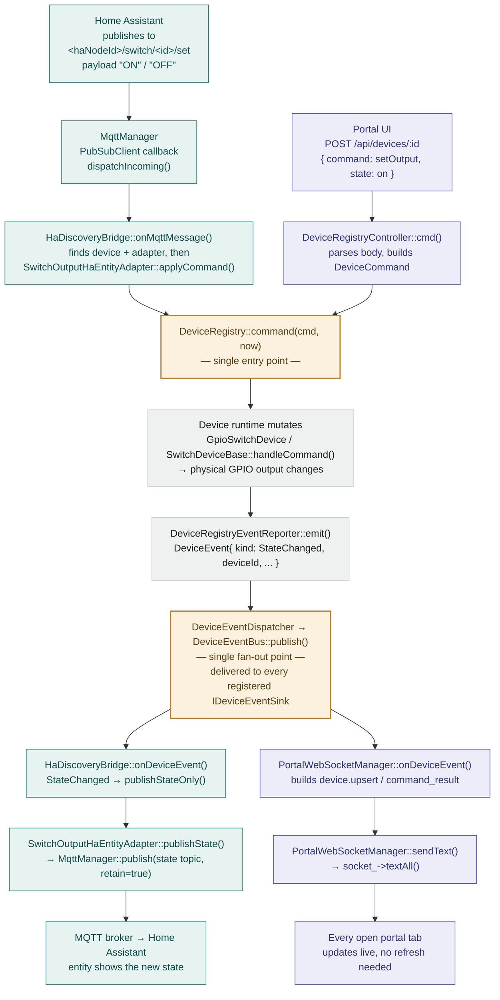

# MQTT + Home Assistant Integration

> User-facing guide: <https://yoreek.github.io/gekko/guides/mqtt-home-assistant/> — keep the two in sync when changing behavior described here.

Optional feature that connects the firmware to an MQTT broker and publishes
Home Assistant MQTT discovery for supported devices. Disabled by default.

## Enabling it

Uncomment in `platformio.ini`:

```ini
	-DWITH_HOME_ASSISTANT
```

This pulls in `knolleary/PubSubClient` and `WiFiClientSecure` (see
`docs/platformio-environments.md`'s flash budget note before enabling it on a
4 MB board).

### Effect of `WITH_HOME_ASSISTANT` being undefined

- `/api/mqtt/*` routes are never registered on the portal HTTP server (any
  request to them 404s) and the per-device `ha` JSON block / `setHaSettings`
  command are absent from the device registry API.
- No MQTT/HA code is linked into the firmware at all — smaller flash, no
  `PubSubClient`/`WiFiClientSecure` dependency.
- The `mqtt.status` WebSocket topic still gets pushed, but always reports
  `enabled: false, connected: false, waitingForStation: false`.
- The portal UI's "Home Assistant" page renders only an explanatory alert
  instead of the settings form, and the per-device "Home Assistant" card on
  the device detail page doesn't render at all.

### Two different meanings of "enabled" — don't confuse them

This feature has **two independent on/off states** that are easy to mix up:

1. **Compiled in** (`WITH_HOME_ASSISTANT`, surfaced as
   `MqttStatusResponse.enabled` / `MqttController::compiledIn()`) — whether
   this firmware *build* has the feature at all. The portal UI's top-level
   "Available"/"Not available" chip on the Home Assistant page reflects
   *this*, not whether MQTT is actively connecting.
2. **Runtime toggle** (`MqttSettings.enabled`, the "Enable MQTT" switch in the
   settings form, persisted via `MqttConfigStore`) — whether the firmware
   should actually attempt to connect to a broker right now. A firmware
   compiled with the flag can still show "Available" while MQTT itself is
   switched off and nothing is being published.

Earlier UI copy reused the generic `status.enabled`/`status.disabled` labels
for the compile-time chip, which reads as if it meant the runtime toggle —
it now uses dedicated `mqtt.compiledInAvailable`/`mqtt.compiledInUnavailable`
strings instead, precisely to avoid this collision.

## Architecture

- `src/platform/MqttManager` — a `StateMachine`-based transport (mirrors
  `ArduinoOtaService`). Gated on `WifiManager::stationReady()` — MQTT never
  attempts to connect in AP-fallback mode, only once the device has a real
  station IP. Runtime settings changes (host, TLS, credentials) bump an
  internal revision counter that forces a clean reconnect on the next tick,
  without a reboot. `onConnect()`/`onMessage()`/`onDisconnect()` are
  **multi-subscriber** (each holds a `std::vector` of callbacks, not a single
  one) — `HaDiscoveryBridge` and `SystemHaPublisher` (see below) each
  register independently without overwriting each other's callback.
- `src/integrations/mqtt/HaDiscoveryBridge` — a `IDeviceEventSink` that
  bridges `DeviceRegistry` changes to Home Assistant MQTT discovery. Knows
  nothing about specific device types; it only talks to the
  `IHaEntityAdapter` interface (`src/integrations/mqtt/HaEntityAdapter.h`).
  Adding a new publishable device type means adding one more adapter, not
  touching the bridge. Convention: every adapter's discovery payload sets an
  explicit `icon` (an `mdi:*` slug) — don't rely on Home Assistant's
  per-domain/per-`device_class` default icon.
  - `HaEntityAdapterRegistry` allows more than one adapter to be registered
    for the same `typeId` — one per HA entity that device type exposes. A
    device with a single channel (switch, DS18B20) has exactly one adapter;
    a multi-channel device (HTU21: temperature + humidity) registers two,
    each producing its own independent discovery topic/`unique_id`. The
    bridge always uses the registry's allocation-free `forEach(typeId, ...)`
    traversal, so it never assumes a device maps to exactly one entity and
    does not allocate a temporary vector on state-change/command paths.
  - Each adapter requests as many topics as its entity needs via a
    `HaTopicBuilder` callback (`topicFor(channel, suffix)` →
    `<haNodeId>/<channel>/<deviceId>/<suffix>`) instead of the bridge handing
    it one fixed state/command topic pair. A simple entity (switch, sensor)
    uses its own `haComponent()` as the channel; a multi-topic entity
    (thermostat) uses distinct channel names per topic — see "Topic scheme"
    below.
  - Applying an incoming command is fully owned by the adapter too:
    `IHaEntityAdapter::applyCommand(registry, runtime, deviceId, commandKey,
    payload, now)` mutates the device however that type requires — a
    lightweight `DeviceCommand` via `DeviceRegistry::command()` for simple
    runtime state (switch ON/OFF), or a full validated config replace via
    `DeviceRegistry::updateConfig()` for persisted settings (thermostat
    mode/setpoint) — the bridge never needs to know which.
- `src/integrations/mqtt/switch/SwitchOutputHaEntityAdapter` — one
  parameterized adapter shared by GPIO and port-expander switches. It builds
  the HA `switch` discovery payload, publishes ON/OFF state, and applies
  incoming `ON`/`OFF` commands as the same `DeviceCommand{SetOutput, ...}`
  shape the REST API already uses. Only `typeId`/`typeName`/`icon` differ
  between registered instances.
- `src/integrations/mqtt/temperature/TemperatureSensorHaEntityAdapter` — a
  generic adapter shared by every temperature-reading device (DS18B20, NTC
  thermistor, ...): builds the HA `sensor` discovery payload
  (`device_class: "temperature"`, `unit_of_measurement: "°C"`) and the state
  payload from the device's latest temperature reading via
  `ITemperatureReadingRuntime`. One instance is registered per device type
  (parameterized by `typeId`/`typeName`/`icon`) instead of a separate adapter
  class per sensor. Read-only — `applyCommand()` always rejects, and no
  `command_topic` is published.
- `src/integrations/mqtt/humidity/HumiditySensorHaEntityAdapter` — the
  humidity counterpart of the adapter above (same generic,
  `typeId`/`typeName`/`icon`-parameterized shape), for any device implementing
  `IHumidityReadingRuntime`. Builds the HA `sensor` discovery payload
  (`device_class: "humidity"`, `unit_of_measurement: "%"`) on its own
  `"humidity_sensor"` channel, distinct from the temperature adapter's
  `"sensor"` channel, so a combo device like HTU21 gets two independent,
  non-colliding topics from one registry entry. Also read-only.
- `src/integrations/mqtt/thermostat/ThermostatHaEntityAdapter` — the
  thermostat-specific adapter: builds the HA `climate` discovery payload
  (`modes: ["off","heat","cool"]`, `min_temp`/`max_temp` from the thermostat's
  own safe range, `temperature_unit: "C"`) and publishes four independent
  state messages (mode, setpoint, current temperature, `action`). Unlike the
  other two adapters, its `applyCommand()` doesn't call
  `DeviceRegistry::command()` at all: `ThermostatDevice` has
  `supportsCommands = false` and no `handleCommand()` override — mode and
  setpoint are persisted config fields, so an incoming HA command is patched
  onto a copy of the current `ThermostatDeviceConfigV1`, re-encoded, and
  applied via `DeviceRegistry::updateConfig()` — the exact same
  validate-then-persist path the portal's own "update config" REST call
  uses, so an out-of-range setpoint from Home Assistant is rejected the same
  way an out-of-range setpoint from the portal UI would be.
- `src/integrations/mqtt/binary/BinarySensorHaEntityAdapter` — the
  binary-sensor adapter: maps `binary_sensor` devices to HA's `binary_sensor`
  component, publishing `ON`/`OFF` from the device's debounced `isActive()`
  level. Skips publishing until the first successful read (`hasReading()`),
  mirroring how the temperature adapter skips invalid readings. No
  `device_class` is set — the firmware config carries no semantic hint
  (door/moisture/...), so the entity stays a generic contact. Read-only.
- `src/integrations/mqtt/dosing/DosingPumpHaEntityAdapters` — one
  Kind-parameterized adapter class registered **five times** for the dosing
  pump (run state, today dosed, container level, container empty, auto-mode
  switch) — the same one-class-many-instances pattern as the generic
  temperature/humidity adapters, chosen over five near-identical classes for
  flash budget. Because five entities share one device name, each discovery
  payload suffixes `name` with a per-entity label ("State", "Today dosed",
  ...) so Home Assistant doesn't show five identically-named entities. Only
  the auto-mode switch accepts commands: `ON`/`OFF` is translated to the same
  `DeviceCommandType::Custom` `"auto"`/`"manual"` payload grammar the REST
  `setMode` command uses, via `DeviceRegistry::command()`. Dose start/stop is
  deliberately **not** exposed to Home Assistant — dosing is chemistry and
  run control stays in the portal UI.
- `src/config/MqttConfigStore` / `src/config/MqttConfig.h` — scalar settings
  persisted the same way as WiFi credentials (`ConfigStore`); the CA
  certificate is a variable-length blob stored via raw `putBlob`/`getBlob`
  (same primitive `DisplayLayoutStore` uses for its layout blob), since it
  doesn't fit the fixed 512-byte per-device config-blob pattern.
- `src/integrations/mqtt/HaDeviceSettings` — per-device HA opt-in
  (`enabled`, optional name override), stored via the existing
  `DeviceScopedDataStore` (the same per-device NVS mechanism
  `DisplayLayoutStore` uses), completely independent of each device type's
  own config struct. A device is **not** published to Home Assistant until
  the user explicitly opts in (`setHaSettings` command, `cmd` action on
  `POST /api/devices/:id`).
- `src/integrations/mqtt/system/SystemHaPublisher` — publishes firmware-level
  diagnostics (uptime, free heap, min free heap, largest free block, heap
  fragmentation, WiFi RSSI/SSID/IP, firmware version/build date) and a
  restart button. Deliberately **not** an `IHaEntityAdapter` and not tied to
  `DeviceRegistry` — these entities describe the board itself and are always
  published under the same HA `device` block as the per-device entities.
  Entity metadata is held in one constexpr descriptor table and processed by
  common discovery/state loops rather than one callback/lambda per entity.
  Discovery + a state refresh happen once on every MQTT connect (birth), then
  state alone repeats every 30s via `tick(now)` (called from `App::tick()`,
  same as `MqttManager::tick()`).
  The restart button reuses `SystemRestartController` — the exact same
  flush-before-reboot safety check and `esp_timer`-based reboot scheduling
  the REST `POST /api/system/restart` endpoint uses (extracted so both paths
  share one implementation instead of duplicating it).

## Command & state round-trip

A command can arrive from two places — Home Assistant over MQTT, or a person
in the portal UI over REST — and both are handled identically from
`DeviceRegistry::command()` onward. Whenever a device's state actually
changes, one event fans back out to **both** destinations at once, so the
portal and Home Assistant never drift apart.



**Why two junctions matter:** both sinks — `HaDiscoveryBridge` and
`PortalWebSocketManager` — register on the same `DeviceEventDispatcher` once,
via `attachDispatcher()`, at startup. Neither class knows the other exists. A
change made from Home Assistant reaches the browser, and a change made in the
browser reaches Home Assistant, purely because they both listen to the same
event bus — not because either side calls the other directly.

This diagram uses the GPIO switch as the worked example. The thermostat's
`ThermostatHaEntityAdapter::applyCommand()` sits at the same "DR" junction
but calls `DeviceRegistry::updateConfig()` instead of `::command()` — see
"Architecture" above for why (mode/setpoint are persisted config, not
lightweight runtime state). Everything downstream of that junction (the
event bus fan-out to both sinks) is identical either way.

## Node and entity identifiers

- **`haNodeId`** — stable identifier used both as the MQTT topic root
  (`<haNodeId>/status`, `<haNodeId>/switch/<deviceId>/state|set`) and as the
  Home Assistant `device.identifiers` value. Defaults, on first boot, to
  `<deviceName>-<macSuffix>` (the same formula `WifiManager::setupApSsid()`
  uses for the setup AP SSID), sanitized to `[a-zA-Z0-9_-]` — the character
  class Home Assistant's MQTT discovery topic scheme requires. **Changing it
  after devices have been announced creates a new device in Home Assistant**
  (the old one is orphaned); the settings UI warns about this.
- **`haNodeName`** — free-form display name for the Home Assistant device
  (`device.name`). Safe to rename at any time; has no effect on topics or
  identifiers.
- Each published device gets `unique_id = "<haNodeId>_<typeName>_<deviceId>"`
  (globally unique across multiple boards sharing one broker/HA instance —
  `deviceId` alone is only unique within one board's registry) and
  `has_entity_name: true` with `name` = the per-device HA name override if
  set, else the device's own `config.name`. `object_id` is set to the same
  stable value; this project doesn't set `default_entity_id`.
- Every discovery payload includes a shared `device` block (grouping all
  entities from one board into one Home Assistant device) and an `origin`
  block (`{name: "Gekko"}`) — the latter is **required** by Home
  Assistant's MQTT discovery schema whenever a payload includes a `device`
  block.
- Discovery JSON uses Home Assistant's official abbreviated keys
  (`uniq_id`, `stat_t`, `cmd_t`, `dev`, `o`, and so on) through semantic
  constants in `HaDiscoveryConstants.h`. Every payload defines
  `"~": "<haNodeId>"`, and topic values are written relatively
  (`"~/switch/42/state"`). Home Assistant expands them back to the exact
  existing MQTT paths, so this reduces retained payload size without changing
  topics, `unique_id`, discovery topics, or existing automations.
- Discovery serialization uses one bounded stack byte buffer and publishes it
  through `MqttManager`'s byte-span overload. Oversized payloads fail
  explicitly instead of allocating whole-payload `vector`/`string` copies.

## Topic scheme

```
<haDiscoveryPrefix>/switch/<haNodeId>/<haNodeId>_gpio_switch_<deviceId>/config   discovery (retained)
<haNodeId>/status                                                               availability (retained, LWT)
<haNodeId>/switch/<deviceId>/state                                              state (retained, "ON"/"OFF")
<haNodeId>/switch/<deviceId>/set                                                command ("ON"/"OFF")

<haDiscoveryPrefix>/sensor/<haNodeId>/<haNodeId>_ds18b20_temperature_sensor_<deviceId>/config   discovery (retained)
<haNodeId>/sensor/<deviceId>/state                                              state (retained, e.g. "23.46")

<haDiscoveryPrefix>/sensor/<haNodeId>/<haNodeId>_ntc_thermistor_temperature_sensor_<deviceId>/config   discovery (retained)
<haNodeId>/sensor/<deviceId>/state                                              state (retained, e.g. "22.10")

# HTU21 registers two adapters for one device/typeId - independent discovery topics and unique_ids
<haDiscoveryPrefix>/sensor/<haNodeId>/<haNodeId>_htu21_<deviceId>/config             discovery (retained, temperature)
<haNodeId>/sensor/<deviceId>/state                                              temperature state (retained, e.g. "24.53")
<haDiscoveryPrefix>/sensor/<haNodeId>/<haNodeId>_htu21_humidity_<deviceId>/config    discovery (retained, humidity)
<haNodeId>/humidity_sensor/<deviceId>/state                                     humidity state (retained, e.g. "48.69")

<haDiscoveryPrefix>/climate/<haNodeId>/<haNodeId>_thermostat_<deviceId>/config   discovery (retained)
<haNodeId>/climate_mode/<deviceId>/state                                        mode state (retained, "off"/"heat"/"cool")
<haNodeId>/climate_mode/<deviceId>/set                                          mode command ("off"/"heat"/"cool")
<haNodeId>/climate_temperature/<deviceId>/state                                 setpoint state (retained, e.g. "24.50")
<haNodeId>/climate_temperature/<deviceId>/set                                   setpoint command (e.g. "24.5")
<haNodeId>/climate_current_temperature/<deviceId>/state                        current temperature (retained, e.g. "23.80")
<haNodeId>/climate_action/<deviceId>/state                                      hvac action (retained, "off"/"idle"/"heating"/"cooling")

<haDiscoveryPrefix>/binary_sensor/<haNodeId>/<haNodeId>_binary_sensor_<deviceId>/config   discovery (retained)
<haNodeId>/binary_sensor/<deviceId>/state                                        state (retained, "ON"/"OFF")

# the dosing pump registers five adapters for one device/typeId - five discovery topics and unique_ids
<haDiscoveryPrefix>/sensor/<haNodeId>/<haNodeId>_dosing_pump_state_<deviceId>/config              discovery (retained, run state)
<haNodeId>/dosing_state/<deviceId>/state                                         run state (retained, "idle"/"dosing")
<haDiscoveryPrefix>/sensor/<haNodeId>/<haNodeId>_dosing_pump_today_dosed_<deviceId>/config        discovery (retained)
<haNodeId>/dosing_today_dosed/<deviceId>/state                                   mL dosed since local midnight (retained, e.g. "12.30")
<haDiscoveryPrefix>/sensor/<haNodeId>/<haNodeId>_dosing_pump_container_level_<deviceId>/config    discovery (retained)
<haNodeId>/dosing_container_level/<deviceId>/state                               container level in mL (retained, e.g. "250.50")
<haDiscoveryPrefix>/binary_sensor/<haNodeId>/<haNodeId>_dosing_pump_container_empty_<deviceId>/config   discovery (retained)
<haNodeId>/dosing_container_empty/<deviceId>/state                               container empty (retained, "ON" = empty/problem)
<haDiscoveryPrefix>/switch/<haNodeId>/<haNodeId>_dosing_pump_auto_mode_<deviceId>/config          discovery (retained)
<haNodeId>/dosing_auto_mode/<deviceId>/state                                     auto mode state (retained, "ON"/"OFF")
<haNodeId>/dosing_auto_mode/<deviceId>/set                                       auto mode command ("ON" -> auto, "OFF" -> manual)

# each system sensor has its own <haDiscoveryPrefix>/sensor/<haNodeId>/<haNodeId>_system_<key>/config
<haNodeId>/system/uptime/state                                                  seconds since boot (retained, e.g. "3600")
<haNodeId>/system/free_heap/state                                               bytes (retained, e.g. "123456")
<haNodeId>/system/heap_fragmentation/state                                      percent 0-100 (retained, e.g. "12")
<haNodeId>/system/wifi_rssi/state                                               dBm (retained, e.g. "-55")
<haNodeId>/system/wifi_ssid/state                                               currently associated SSID (retained)
<haNodeId>/system/wifi_ip/state                                                 station IP (retained)
<haNodeId>/system/firmware_version/state                                       git describe string, e.g. "e040034" or "v1.0.0-3-gabc1234" (retained)
<haNodeId>/system/firmware_build_date/state                                    ISO 8601 UTC timestamp, e.g. "2026-07-08T07:41:06Z" (retained)

<haDiscoveryPrefix>/button/<haNodeId>/<haNodeId>_system_restart/config           discovery (retained)
<haNodeId>/system/restart/set                                                   command (any payload triggers it)
```

Temperature/humidity sensors (DS18B20, NTC thermistor, HTU21), the binary
sensor, and the dosing pump's four monitoring entities have no `set` topic —
the wildcard command subscription below still matches their state topic
shape, but their `applyCommand()` always rejects, so no command ever reaches
the device.

The thermostat's "channel" segment (`climate_mode`, `climate_temperature`,
`climate_current_temperature`, `climate_action`) is not the HA component name
(that's always `climate`, used only in the discovery topic) — it's a
per-topic key `ThermostatHaEntityAdapter` picks so a single entity can own
several independent state/command topics. `HaDiscoveryBridge` never
special-cases this; it just passes whatever channel the topic used through
to `applyCommand()`/`publishState()` as an opaque string.

The bridge subscribes to a **single wildcard** `<haNodeId>/+/+/set` once, on
connect — not one subscription per entity or per channel. New devices (and
new channels within an existing entity) are picked up automatically without
any resubscribe; incoming messages are routed to the right device by parsing
the topic's device-id segment and looking up its runtime/adapter, not by the
number of active subscriptions.

`SystemHaPublisher`'s `system/restart/set` topic also matches this same
wildcard shape (`<haNodeId>/system/restart/set` → 4 segments), so both
`HaDiscoveryBridge` and `SystemHaPublisher` receive every incoming message
(that's why `MqttManager::onMessage()` is multi-subscriber) and each just
ignores whatever isn't meant for it — `HaDiscoveryBridge` fails to parse
`"restart"` as a numeric device id and returns; `SystemHaPublisher` only
reacts to the one exact topic it owns.

Unlike per-device entities, the system entities have **no opt-in toggle** -
they're always published whenever MQTT is enabled and connected, since they
describe the board itself rather than a specific `DeviceRegistry` device.
They're also on a different cadence: instead of being event-driven
(published only when something changes), state repeats unconditionally every
30 seconds, because "free heap" and "uptime" don't have discrete change
events the way a switch's on/off state does.

## Lifecycle (birth/LWT)

- `MqttManager::setWill(<haNodeId>/status, "offline", retain=true)` is armed
  once, before the first connection attempt, so the broker publishes it if
  the device disconnects uncleanly.
- On every successful connect, `HaDiscoveryBridge` publishes `"online"` to
  `<haNodeId>/status` (retained), resubscribes the command wildcard, and
  republishes discovery + current state for every device that has opted in —
  this is what makes a broker restart or firmware reconnect self-healing
  without manual re-discovery in Home Assistant. `SystemHaPublisher`
  independently does the same for the system diagnostics/restart entities on
  the same connect event (both register their own `MqttManager::onConnect()`
  callback).

## TLS

- CA-certificate-only server verification (`WiFiClientSecure::setCACert`), no
  client certificate/mTLS.
- If `useTls` is enabled but no CA certificate has been uploaded,
  `MqttManager` refuses to connect (goes to a `Faulted` state with a log
  line) rather than silently falling back to an insecure connection.
- The certificate is uploaded as a PEM file via
  `POST /api/mqtt/ca-cert` (multipart, field `cert`) and removed via
  `DELETE /api/mqtt/ca-cert`.

## REST contract

See `docs/rest-api-contract.md`'s `## MQTT` section for the full request/response
shapes (`/api/mqtt/status`, `/api/mqtt/settings`, `/api/mqtt/ca-cert`, and the
per-device `ha` block / `setHaSettings` command).

## Current scope

The following device types are published to Home Assistant in this iteration:

- GPIO switch (`gpio_switch`) — mapped to HA's `switch` component, with
  `icon: "mdi:toggle-switch"` and command support (`ON`/`OFF` routed back
  through `DeviceRegistry::command`).
- DS18B20 temperature sensor (`ds18b20_temperature_sensor`) and NTC
  thermistor temperature sensor (`ntc_thermistor_temperature_sensor`) —
  mapped to HA's `sensor` component with `device_class: "temperature"`,
  `state_class: "measurement"`, `unit_of_measurement: "°C"`, and an adapter
  icon (`mdi:thermometer` / `mdi:thermometer-lines`). Read-only: no
  `command_topic` is published and incoming commands are rejected. The state
  is always published in Celsius regardless of the device's configured
  display unit (that setting only affects the portal UI/OLED output) — Home
  Assistant converts to the user's preferred unit on its own.
- HTU21 temperature+humidity sensor (`htu21`) — publishes **two** independent
  HA `sensor` entities from one device: temperature (`icon: "mdi:thermometer"`,
  same shape as DS18B20/NTC above) and humidity (`device_class: "humidity"`,
  `unit_of_measurement: "%"`, `icon: "mdi:water-percent"`). Both are
  read-only. This is the first device type to register two
  `IHaEntityAdapter` instances for the same `typeId` — see the
  `HaEntityAdapterRegistry`/`forEach()` note in "Architecture" above.
- Thermostat (`thermostat`) — mapped to HA's `climate` component, with
  `icon: "mdi:thermostat"`, `modes: ["off","heat","cool"]`,
  `min_temp`/`max_temp` taken from the thermostat's own configured safe
  range, `temp_step: 0.5`, `precision: 0.1`, `temperature_unit: "C"`. Mode
  and setpoint changes from Home Assistant are applied through
  `DeviceRegistry::updateConfig()` (full validated config replace, see
  "Architecture" above) — an out-of-range setpoint is rejected exactly like
  it would be from the portal UI. The `action` topic (`off`/`idle`/`heating`/
  `cooling`) is derived from the thermostat's own mode + actual switch output
  state, not a separate stored field.
- Analog output (`analog_output`, `fade_analog_output`, `scheduled_analog_output`) —
  each mapped to HA's `light` component via one shared `AnalogOutputHaEntityAdapter`
  (`icon: "mdi:brightness-6"`), using `on_command_type: "brightness"` and a separate
  `brightness_state_topic`/`brightness_command_topic` pair (`brightness_scale: 255`).
  Firmware's internal `0..4095` level converts to/from HA's `0..255` brightness scale;
  a bare `ON`/`OFF` command maps to `100`/`0` on the underlying `SetOutput` command.
  The state-payload parser also accepts a JSON object (`{"state": "on"}`,
  `{"statePercent": 50}`, `{"brightness": 128}`, or a raw `0..4095` `state` number) in
  addition to the plain `ON`/`OFF`/percent/brightness forms.
  `scheduled_analog_output` additionally publishes a `select` entity
  (`scheduled_analog_output_mode`, `entity_category: "config"`,
  `icon: "mdi:calendar-sync"`, options `off`/`manual`/`scheduled`) for its
  Off/Manual/Scheduled mode.
- Analog output composer (`analog_output_composer`) — publishes **no** `light` entity
  (it isn't itself a scalar output) but does publish the same kind of `select` mode
  entity as scheduled analog output (`analog_output_group_mode`), which applies the
  chosen mode to every compatible child channel. See
  [Analog Output](analog-output.md) for the decorator-chain architecture behind these
  three types.
- Binary sensor (`binary_sensor`) — mapped to HA's `binary_sensor` component
  with `icon: "mdi:electric-switch"` and no `device_class` (the firmware
  config has no semantic hint; pick one per-entity in HA if wanted).
  Publishes `ON` when `isActive()` (debounced level XOR `inverted`), nothing
  until the first successful read. Read-only.
- Dosing pump (`dosing_pump_*`) — publishes **five** entities from one
  device (see "Architecture" above for the Kind-parameterized adapter):
  - run state — `sensor`, `device_class: "enum"`,
    `options: ["idle", "dosing"]`, `icon: "mdi:pump"`. Enum sensors must not
    carry `unit_of_measurement`/`state_class` (HA rejects the payload).
  - today dosed — `sensor`, `device_class: "volume"`,
    `unit_of_measurement: "mL"`, `state_class: "total_increasing"` — the drop
    at local midnight reads as a meter reset, which is exactly how the
    firmware's per-day counter behaves. `icon: "mdi:beaker-check"`.
  - container level — `sensor`, `device_class: "volume"`,
    `unit_of_measurement: "mL"`, `state_class: "measurement"`,
    `icon: "mdi:cup-water"`. Published in mL (not %) for parity with the REST
    API's `containerCurrentMl`; a percentage can be templated in HA.
  - container empty — `binary_sensor`, `device_class: "problem"`
    (`ON` = empty), `icon: "mdi:cup-off-outline"`. Meaningful even without a
    level sensor (falls back to the tracked volume hitting zero).
  - auto mode — `switch`, `entity_category: "config"`,
    `icon: "mdi:calendar-sync"`. `ON`/`OFF` from HA becomes the same
    `DeviceCommandType::Custom` `"auto"`/`"manual"` command the REST
    `setMode` uses. Dose start/stop is deliberately not exposed to HA.

Other device types (displays) are out of scope for now, but the
adapter/registry seam (`IHaEntityAdapter`/`HaEntityAdapterRegistry`) is
designed so adding one — whether it needs one HA entity or several, like
HTU21 — is a new adapter file (or a second registration for an existing
adapter class) and a `withDefaults()` line, not a change to
`HaDiscoveryBridge` or `MqttManager`.

In addition to per-device entities, `SystemHaPublisher` always publishes ten
firmware-level diagnostic sensors and a restart button, regardless of which
(if any) devices exist in the registry:

- **Uptime** — `sensor`, `device_class: "duration"`, `unit_of_measurement: "s"`,
  seconds since boot. No wall-clock/NTP dependency (the firmware doesn't sync
  real time anywhere) — a `device_class: "timestamp"` "last boot" sensor was
  considered and rejected for exactly that reason.
- **Free heap** / **heap fragmentation** — `sensor`, `entity_category: "diagnostic"`,
  backed by a new `ISystemStats` interface (`ArduinoSystemStats` wraps
  `ESP.getFreeHeap()`/`ESP.getMaxAllocHeap()`).
- **WiFi RSSI** — `sensor`, `device_class: "signal_strength"`, `unit_of_measurement: "dBm"`.
- **WiFi SSID** / **WiFi IP** — plain diagnostic `sensor`s.
- **Firmware version** — plain diagnostic `sensor`, the `git describe` string
  from `generated/Version.h` (see `docs/../README.md` for how it's generated).
- **Firmware build date** — `sensor`, `device_class: "timestamp"`, the ISO 8601
  UTC build timestamp from `generated/Version.h`.
- **Restart** — `button`, `device_class: "restart"`, `entity_category: "config"`.
  Routes through `SystemRestartController::requestRestart()` +
  `::scheduleReboot()` — the same flush-before-reboot safety check the REST
  restart endpoint uses, not a separate/weaker path.

WiFi RSSI/SSID needed two new non-pure `IWifiDriver` methods (`rssi()`/
`ssid()`, default `0`/`""`) — non-pure specifically so the many existing
`FakeWifiDriver` test doubles across the test suite didn't all need updating.
