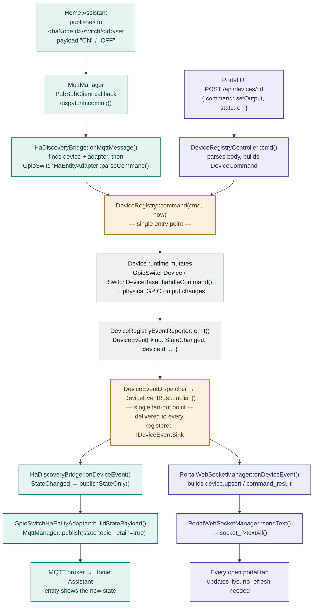

# MQTT + Home Assistant Integration

Optional feature that connects the firmware to an MQTT broker and publishes
Home Assistant MQTT discovery for supported devices. Disabled by default.

## Enabling it

Uncomment in `platformio.ini`:

```ini
	-DWITH_HOME_ASSISTANT
```

This pulls in `knolleary/PubSubClient` and `WiFiClientSecure` (see
`docs/platformio-environments.md`'s flash budget note before enabling it on a
4 MB board).

### Effect of `WITH_HOME_ASSISTANT` being undefined

- `/api/mqtt/*` routes are never registered on the portal HTTP server (any
  request to them 404s) and the per-device `ha` JSON block / `setHaSettings`
  command are absent from the device registry API.
- No MQTT/HA code is linked into the firmware at all — smaller flash, no
  `PubSubClient`/`WiFiClientSecure` dependency.
- The `mqtt.status` WebSocket topic still gets pushed, but always reports
  `enabled: false, connected: false, waitingForStation: false`.
- The portal UI's "Home Assistant" page renders only an explanatory alert
  instead of the settings form, and the per-device "Home Assistant" card on
  the device detail page doesn't render at all.

### Two different meanings of "enabled" — don't confuse them

This feature has **two independent on/off states** that are easy to mix up:

1. **Compiled in** (`WITH_HOME_ASSISTANT`, surfaced as
   `MqttStatusResponse.enabled` / `MqttController::compiledIn()`) — whether
   this firmware *build* has the feature at all. The portal UI's top-level
   "Available"/"Not available" chip on the Home Assistant page reflects
   *this*, not whether MQTT is actively connecting.
2. **Runtime toggle** (`MqttSettings.enabled`, the "Enable MQTT" switch in the
   settings form, persisted via `MqttConfigStore`) — whether the firmware
   should actually attempt to connect to a broker right now. A firmware
   compiled with the flag can still show "Available" while MQTT itself is
   switched off and nothing is being published.

Earlier UI copy reused the generic `status.enabled`/`status.disabled` labels
for the compile-time chip, which reads as if it meant the runtime toggle —
it now uses dedicated `mqtt.compiledInAvailable`/`mqtt.compiledInUnavailable`
strings instead, precisely to avoid this collision.

## Architecture

- `src/platform/MqttManager` — a `StateMachine`-based transport (mirrors
  `ArduinoOtaService`). Gated on `WifiManager::stationReady()` — MQTT never
  attempts to connect in AP-fallback mode, only once the device has a real
  station IP. Runtime settings changes (host, TLS, credentials) bump an
  internal revision counter that forces a clean reconnect on the next tick,
  without a reboot.
- `src/integrations/mqtt/HaDiscoveryBridge` — a `IDeviceEventSink` that
  bridges `DeviceRegistry` changes to Home Assistant MQTT discovery. Knows
  nothing about specific device types; it only talks to the
  `IHaEntityAdapter` interface (`src/integrations/mqtt/HaEntityAdapter.h`).
  Adding a new publishable device type means adding one more adapter, not
  touching the bridge.
- `src/integrations/mqtt/gpio_switch/GpioSwitchHaEntityAdapter` — the only
  GPIO-switch-specific code: builds the HA `switch` discovery payload, the
  ON/OFF state payload, and parses incoming `ON`/`OFF` commands into the same
  `DeviceCommand{SetOutput, ...}` shape the REST API already uses (so HA
  commands go through the same validation/persistence path as the portal UI).
- `src/config/MqttConfigStore` / `src/config/MqttConfig.h` — scalar settings
  persisted the same way as WiFi credentials (`ConfigStore`); the CA
  certificate is a variable-length blob stored via raw `putBlob`/`getBlob`
  (same primitive `DisplayLayoutStore` uses for its layout blob), since it
  doesn't fit the fixed 512-byte per-device config-blob pattern.
- `src/integrations/mqtt/HaDeviceSettings` — per-device HA opt-in
  (`enabled`, optional name override), stored via the existing
  `DeviceScopedDataStore` (the same per-device NVS mechanism
  `DisplayLayoutStore` uses), completely independent of each device type's
  own config struct. A device is **not** published to Home Assistant until
  the user explicitly opts in (`setHaSettings` command, `cmd` action on
  `POST /api/devices/:id`).

## Command & state round-trip

A command can arrive from two places — Home Assistant over MQTT, or a person
in the portal UI over REST — and both are handled identically from
`DeviceRegistry::command()` onward. Whenever a device's state actually
changes, one event fans back out to **both** destinations at once, so the
portal and Home Assistant never drift apart.



**Why two junctions matter:** both sinks — `HaDiscoveryBridge` and
`PortalWebSocketManager` — register on the same `DeviceEventDispatcher` once,
via `attachDispatcher()`, at startup. Neither class knows the other exists. A
change made from Home Assistant reaches the browser, and a change made in the
browser reaches Home Assistant, purely because they both listen to the same
event bus — not because either side calls the other directly.

## Node and entity identifiers

- **`haNodeId`** — stable identifier used both as the MQTT topic root
  (`<haNodeId>/status`, `<haNodeId>/switch/<deviceId>/state|set`) and as the
  Home Assistant `device.identifiers` value. Defaults, on first boot, to
  `<deviceName>-<macSuffix>` (the same formula `WifiManager::setupApSsid()`
  uses for the setup AP SSID), sanitized to `[a-zA-Z0-9_-]` — the character
  class Home Assistant's MQTT discovery topic scheme requires. **Changing it
  after devices have been announced creates a new device in Home Assistant**
  (the old one is orphaned); the settings UI warns about this.
- **`haNodeName`** — free-form display name for the Home Assistant device
  (`device.name`). Safe to rename at any time; has no effect on topics or
  identifiers.
- Each published device gets `unique_id = "<haNodeId>_<typeName>_<deviceId>"`
  (globally unique across multiple boards sharing one broker/HA instance —
  `deviceId` alone is only unique within one board's registry) and
  `has_entity_name: true` with `name` = the per-device HA name override if
  set, else the device's own `config.name`. `object_id`/`entity_id` are left
  for Home Assistant to auto-generate; this project doesn't attempt to
  control them via `default_entity_id`.
- Every discovery payload includes a shared `device` block (grouping all
  entities from one board into one Home Assistant device) and an `origin`
  block (`{name: "ESP32WIFIManager"}`) — the latter is **required** by Home
  Assistant's MQTT discovery schema whenever a payload includes a `device`
  block.

## Topic scheme (GPIO switch)

```
<haDiscoveryPrefix>/switch/<haNodeId>/<haNodeId>_gpio_switch_<deviceId>/config   discovery (retained)
<haNodeId>/status                                                               availability (retained, LWT)
<haNodeId>/switch/<deviceId>/state                                              state (retained, "ON"/"OFF")
<haNodeId>/switch/<deviceId>/set                                                command ("ON"/"OFF")
```

The bridge subscribes to a **single wildcard** `<haNodeId>/+/+/set` once, on
connect — not one subscription per entity. New devices created afterwards are
picked up automatically without any resubscribe; incoming messages are routed
to the right device by parsing the topic's device-id segment and looking up
its runtime/adapter, not by the number of active subscriptions.

## Lifecycle (birth/LWT)

- `MqttManager::setWill(<haNodeId>/status, "offline", retain=true)` is armed
  once, before the first connection attempt, so the broker publishes it if
  the device disconnects uncleanly.
- On every successful connect, `HaDiscoveryBridge` publishes `"online"` to
  `<haNodeId>/status` (retained), resubscribes the command wildcard, and
  republishes discovery + current state for every device that has opted in —
  this is what makes a broker restart or firmware reconnect self-healing
  without manual re-discovery in Home Assistant.

## TLS

- CA-certificate-only server verification (`WiFiClientSecure::setCACert`), no
  client certificate/mTLS.
- If `useTls` is enabled but no CA certificate has been uploaded,
  `MqttManager` refuses to connect (goes to a `Faulted` state with a log
  line) rather than silently falling back to an insecure connection.
- The certificate is uploaded as a PEM file via
  `POST /api/mqtt/ca-cert` (multipart, field `cert`) and removed via
  `DELETE /api/mqtt/ca-cert`.

## REST contract

See `docs/rest-api-contract.md`'s `## MQTT` section for the full request/response
shapes (`/api/mqtt/status`, `/api/mqtt/settings`, `/api/mqtt/ca-cert`, and the
per-device `ha` block / `setHaSettings` command).

## Current scope

Only GPIO switch devices (`gpio_switch`) are published to Home Assistant in
this iteration, mapped to HA's `switch` component. Other device types
(temperature sensors, thermostat, displays) are out of scope for now, but the
adapter/registry seam (`IHaEntityAdapter`/`HaEntityAdapterRegistry`) is
designed so adding one is a new adapter file, not a change to
`HaDiscoveryBridge` or `MqttManager`.
